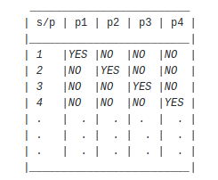

**8. The Stones Game                      https://a2oj.com/p?ID=8**

The problem at first might seem tricky ... You might think about using some sort of recursion or even a graph algorithm to find all the possible ways the game might end up like.

The solution is pretty simple ... Comming up with a simple pattern that always works whichever the values are.

By sketching multiple test cases you'll find out that for player P to win in any game, this relation must be true :

    (s-p)%n==0
    
Where "s" is the number of stones, "p" is the given player and "n" is the number of players.
We got this little equation by noticing that for player "p" to have a chance for winning is to keep adding the number of players "n" to its value until we reach the given number of stones "s". If we reached the given "s" by doing this addition then this player can win, else, he can't.

This table might make it simpler to visualize what I am saying for a number of players "n"=4.

 at stone 5 the pattern starts repeating itself and the same for stone 9, 13, 17 ... 10^9
 
 "YES" donates that for the given player "p" and a given number of stones "s" this player has a chance to win.
 "NO" donates that for the given player "p" and a given number of stones "s" this player has no chance to win.
 
 For player 4 to win the number of stones should be : 4,8,12,16,20 ....
 For player 1 to win the number of stones should be : 1,5,9,13,17 .....
 
 It could be written as :
      
      p+x*n=s
 
OR
      s-x*n=p
 where s is the number of stones, x is an arbitary constant, n is the number of players, and p is the given player.
 
 Thus, (s-p) should be divisible by n to give an integer constant x.
